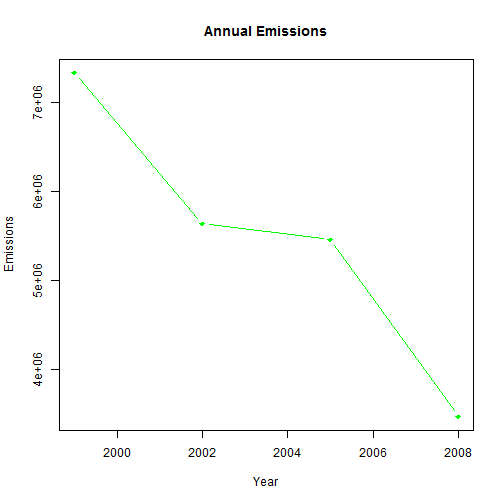
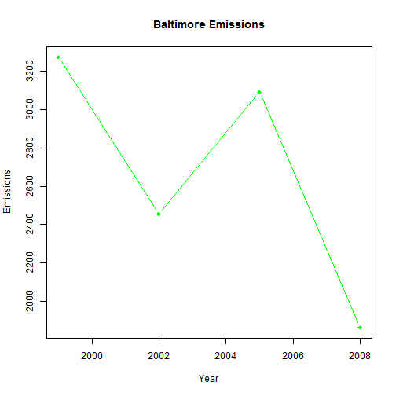
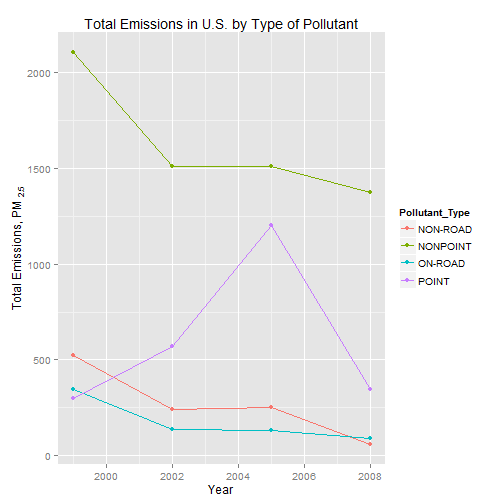
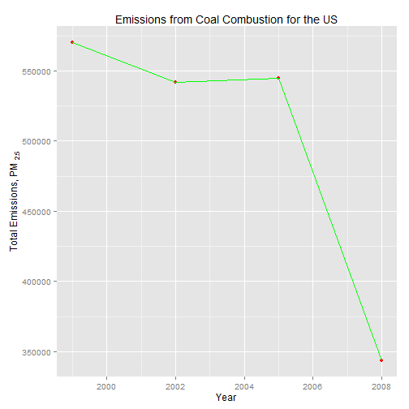
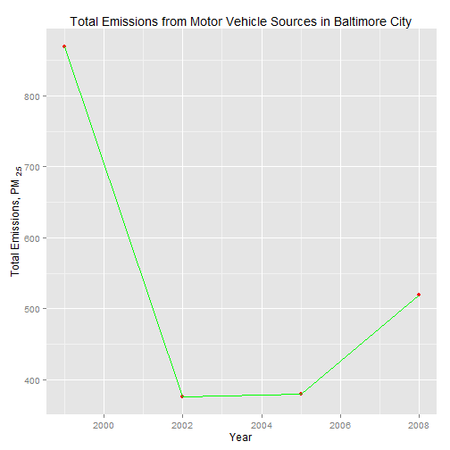

# Analysis of pollution in the United states based on National Emissions Inventory database
========================================================
Fine particulate matter (PM2.5) is an ambient air pollutant for which there is strong evidence that it is harmful to human health. In the United States, the Environmental Protection Agency (EPA) is tasked with setting national ambient air quality standards for fine PM and for tracking the emissions of this pollutant into the atmosphere. Approximatly every 3 years, the EPA releases its database on emissions of PM2.5. This database is known as the National Emissions Inventory (NEI). You can read more information about the NEI at the EPA National Emissions Inventory web site.

For each year and for each type of PM source, the NEI records how many tons of PM2.5 were emitted from that source over the course of the entire year. The data that will be use for this assignment are for 1999, 2002, 2005, and 2008.
 Have total emissions from PM2.5 decreased in the United States from 1999 to 2008?
 Using the base plotting system, make a plot showing the total PM2.5 emission from
 all sources for each of the years 1999, 2002, 2005, and 2008.
 
The overall goal of this assignment is to explore the National Emissions Inventory database and see what it say about fine particulate matter pollution in the United states over the 10-year period 1999-2008. You may use any R package you want to support your analysis.
## load required libraries

```r
library(plyr)
library(ggplot2)
library(data.table)
```


```r
## This first line will likely take a few seconds. Be patient!
NEI <- readRDS("summarySCC_PM25.rds")
SCC <- readRDS("Source_Classification_Code.rds")
```


```r
## Convert into data.table
NEI.DT = data.table(NEI)
SCC.DT = data.table(SCC)
```


# Problem 1
Aggreate emission per year

```r
total.emissions <- with(NEI, aggregate(Emissions, by = list(year), sum))
```


Open the PNG device

```r
png(filename = "plot1.png", width = 480, height = 480, units = "px")
```


## Plot emissions per year using basic package
## Total emissions from PM2.5 decreased in the United States from 1999 to 2008

```r
plot(total.emissions, type = "b", pch = 18, col = "green", ylab = "Emissions", 
    xlab = "Year", main = "Annual Emissions")
```

 

```r
# Close the PNG device
dev.off()
```

```
## png 
##   3
```

# problem 2


Aggregate Emissions by year and county and filter "24510"

```r
NEI.24510 <- NEI[which(NEI$fips == "24510"), ]
total.emissions.baltimore <- with(NEI.24510, aggregate(Emissions, by = list(year), 
    sum))
colnames(total.emissions.baltimore) <- c("year", "Emissions")
```


Open the PNG device

```r
png(filename = "plot2.png", width = 480, height = 480, units = "px")
```


## Total emissions from PM2.5 on average decreased in the Baltimore City, Maryland from 1999 to 2008

```r
plot(total.emissions.baltimore$year, total.emissions.baltimore$Emissions, type = "b", 
    pch = 18, col = "green", ylab = "Emissions", xlab = "Year", main = "Baltimore Emissions")
```

 

```r
# Close the PNG device
dev.off()
```

```
## png 
##   3
```


## Problem 3

Aggregate Emissions by year and filter "24510"

```r
NEI.24510 <- NEI[which(NEI$fips == "24510"), ]
total.emissions.baltimore <- with(NEI.24510, aggregate(Emissions, by = list(year), 
    sum))
colnames(total.emissions.baltimore) <- c("year", "Emissions")
```

 Aggregate Emissions by year, county, type and filter "24510"


```r
total.emissions.baltimore.type <- ddply(NEI.24510, .(type, year), summarize, 
    Emissions = sum(Emissions))
total.emissions.baltimore.type$Pollutant_Type <- total.emissions.baltimore.type$type
```


 Plot emissions per year grouped by source type using ggplot2 plotting system
 NON-ROAD, NONPOINT, ON-ROAD type sources have seen decreases in emissions.
 POINT type has seen increased emissions until year 2005 and then decreased.
 # Open the PNG device

```r
# png(filename='plot3.png', width=480, height=480, units='px')
qplot(year, Emissions, data = total.emissions.baltimore.type, group = Pollutant_Type, 
    color = Pollutant_Type, geom = c("point", "line"), ylab = expression("Total Emissions, PM"[2.5]), 
    xlab = "Year", main = "Total Emissions in U.S. by Type of Pollutant")
```

 

```r

# Close the PNG device dev.off()
```

# Problem 4
 Obtain SCC codes for coal combustion related surces using SCC.Level.Three variable

```r
coal.scc = SCC.DT[grep("Coal", SCC.Level.Three), SCC]
```


 Aggregate Emissions for the above SCC by year

```r
coal.emissions = NEI.DT[SCC %in% coal.scc, sum(Emissions), by = "year"]
colnames(coal.emissions) <- c("year", "Emissions")
```


Open the PNG device

```r
png(filename = "plot4.png", width = 480, height = 480, units = "px")
```


Plot emissions per year using ggplot2 plotting system
 Emissions from coal combustion related sources decreased significantly from 1999-2008.


```r
g = ggplot(coal.emissions, aes(year, Emissions))
g + geom_point(color = "red") + geom_line(color = "green") + labs(x = "Year") + 
    labs(y = expression("Total Emissions, PM"[2.5])) + labs(title = "Emissions from Coal Combustion for the US")
```

 

```r
# Close the PNG device
dev.off()
```

```
## png 
##   3
```


# Problem 5


 Obtain SCC codes for motor vehicle sources using EI.Sector variable

```r
motor.vehicle.scc = SCC.DT[grep("[Mm]obile|[Vv]ehicles", EI.Sector), SCC]
```


 Aggregate Emissions for the above SCC by year and county and filter Baltimore City

```r
motor.vehicle.emissions.baltimore = NEI.DT[SCC %in% motor.vehicle.scc, sum(Emissions), 
    by = c("year", "fips")][fips == "24510"]
colnames(motor.vehicle.emissions.baltimore) <- c("year", "fips", "Emissions")
```


Open the PNG device

```r
png(filename = "plot5.png", width = 480, height = 480, units = "px")
```


 Plot emissions per year using ggplot2 plotting system
 Emissions from motor vehicle sources decreased from 1999-2008 in Baltimore City, even though there was a blip in the year 2008.


```r
g = ggplot(motor.vehicle.emissions.baltimore, aes(year, Emissions))
g + geom_point(color = "red") + geom_line(color = "green") + labs(x = "Year") + 
    labs(y = expression("Total Emissions, PM"[2.5])) + labs(title = "Total Emissions from Motor Vehicle Sources in Baltimore City")
```

 

```r


# Close the PNG device
dev.off()
```

```
## png 
##   3
```

# problem 6
Aggregate Emissions for the above SCC by year and county


```r
motor.vehicle.emissions = NEI.DT[SCC %in% motor.vehicle.scc, sum(Emissions), 
    by = c("year", "fips")]
colnames(motor.vehicle.emissions) <- c("year", "fips", "Emissions")
```


 Open the PNG device

```r
png(filename = "plot6.png", width = 480, height = 480, units = "px")
```

 Plot emissions per year grouped by fips using ggplot2 plotting system
 Use log scale to plot rate of change.
 Observe steeper slopes for Baltimore City, indicating it has seen greater changes.


```r
g = ggplot(motor.vehicle.emissions[fips == "24510" | fips == "06037"], aes(year, 
    log(V1)))
g + geom_point() + geom_line(aes(color = fips)) + scale_color_discrete(name = "County", 
    breaks = c("06037", "24510"), labels = c("Los Angeles", "Baltimore")) + 
    labs(x = "Year") + labs(y = expression("Total Emissions, PM"[2.5])) + labs(title = "Annual Motor Vehicle Emissions")
```

```
## Error: object 'V1' not found
```

```r


# Close the PNG device
dev.off()
```

```
## png 
##   3
```


